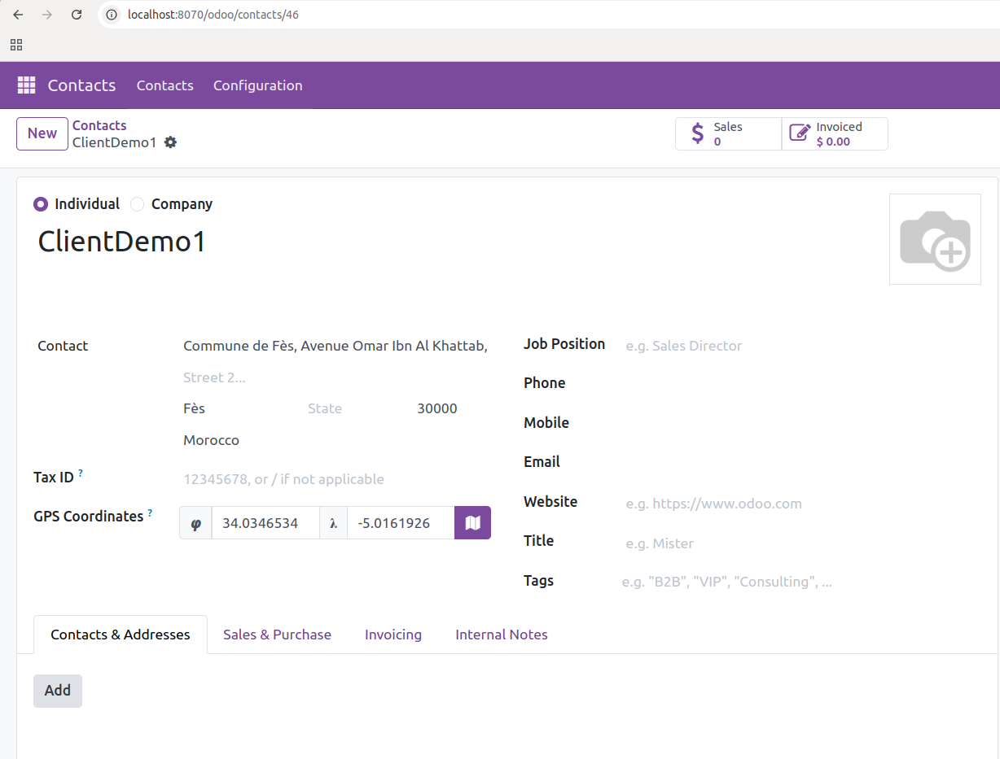
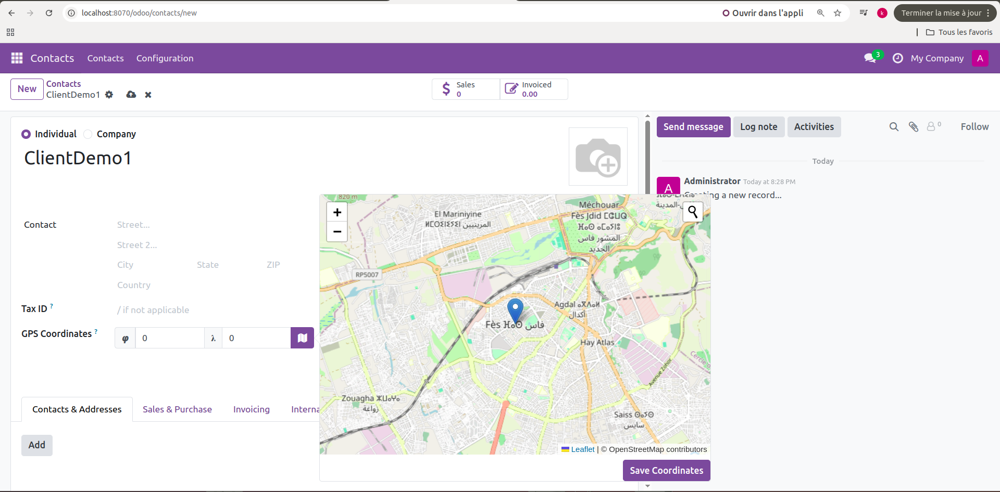
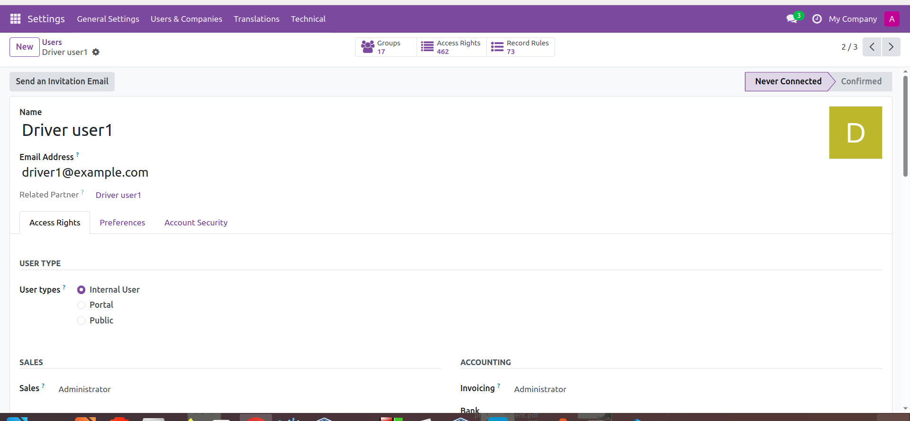
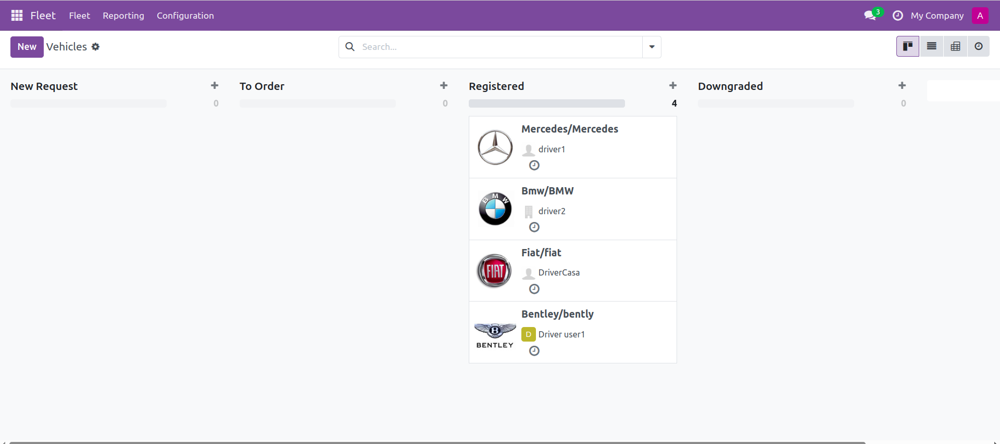
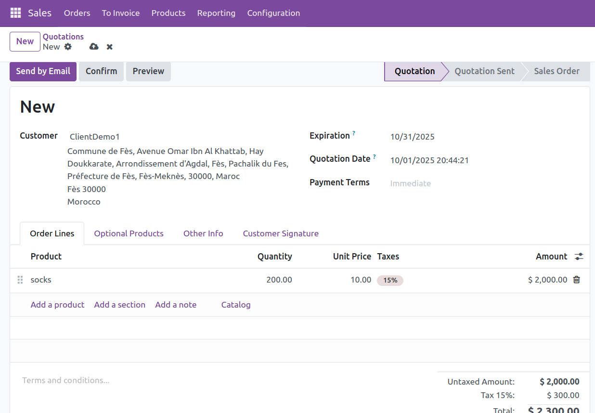
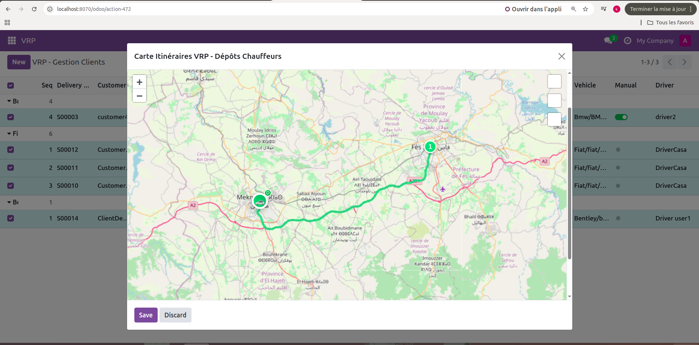
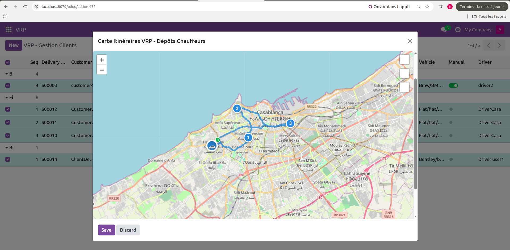
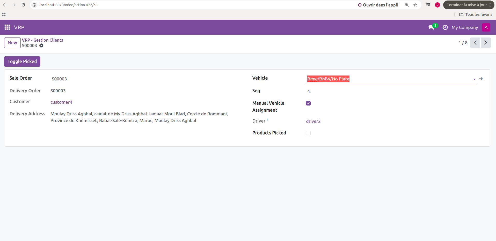

# VRP Delivery Optimization Module for Odoo 18

## 📋 Table of Contents
- [Overview](#overview)
- [Prerequisites](#prerequisites)
- [Installation](#installation)
- [Configuration](#configuration)
- [Usage](#usage)
- [Technical Architecture](#technical-architecture)
- [Contribution](#contribution)

---

## Overview
Odoo 18 module for automatic delivery route optimization using the VRP (Vehicle Routing Problem) algorithm with Google OR-Tools.  
The system intelligently assigns orders to available vehicles based on the geographical proximity of drivers.

### Key Features
- Automatic route optimization based on drivers’ GPS positions  
- Interactive map visualization with Leaflet.js  
- Real distance calculation via OSRM API  
- Product picking management  
- Automatic synchronization between Sales Orders and VRP  

---

## Prerequisites
- Odoo 18  
- Python 3.10+  
- Docker >= 20.10  
- Docker Compose >= 1.29 (or Compose v2 >= 2.12)  
- PostgreSQL 15+  

---

## Installation

1. **Step 1: Clone the repository**
```bash
git clone https://github.com/your-username/vrp-module.git
cd vrp-module
```


2. Step 2: Start Docker containers
```bash
# Build the images
docker-compose build

# Start the services
docker-compose up -d

```

3. Step 3: Access Odoo
- Odoo Interface: http://localhost:8070
- Default credentials: admin / admin
- Database: Create a new one (any name)

4. Step 4: Install the module
- Activate developer mode: Settings > Developer Tools > Activate
- Go to Apps
- Remove the “Apps” filter in the search bar
- Search for “VRP”
- Click on Install


# Main Features of the VRP (Vehicle Routing Problem) Module

Each feature is explained with screenshots for better understanding.
---

## 1. Create a New Customer
- **Step 1**: Go to **Contacts** from the main menu (top left).  
- **Step 2**: Click **New**.  
- **Step 3**: Add the customer's **Name** and **Location**.  

### Screenshot
  
  
---

## 2. Create Users – Drivers
- **Step 1**: Go to **Settings** from the main menu.  
- **Step 2**: Click on **Users & Companies > Users** in the top menu.  
- **Step 3**: Click **New**. Fill in all the required information about the driver, then click **Save**.  
- **Step 4**: Return to **Contacts** from the main menu.  
- **Step 5**: Click **New**.  
- **Step 6**: Add the driver's **Name** and **Location**.  

✅ The new driver is created.  

### Screenshot
  

---

## 3. Create Vehicles
- **Step 1**: Go to **Fleet** from the main menu.  
- **Step 2**: Click **New**.  
- **Step 3**: Enter the vehicle **Model**.  
- **Step 4**: A new window will open. Add the vehicle details including **Type** and **Category**, then click **Save & Close**.  
- **Step 5**: Assign the vehicle to a **Driver**.  

✅ The vehicle is created.  
Then, you can move the vehicle request from **New Request** to **Registered**.  
Registered vehicles are now available for deliveries.  

### Screenshot
  

---

## 4. Create a New Sales Order
- Go to the **Sales** module.  
- Click **New**, fill in the order details, then click **Confirm**.  

### Screenshot
  

---

## 5. Optimize Routes
Once a customer order is created:  
- **Step 1**: Go to the **VRP** module from the main menu.  
- **Step 2**: In the VRP module, you can add the customers you already created in the **Sales** module.  
- **Step 3**: You can view the list of all orders.  
- **Step 4**: Select all orders.  
- **Step 5**: Click the **Optimise Enhanced** button at the top center of the screen.  

✅ The system automatically distributes orders among drivers based on their geographical proximity.  

### Screenshot
  

---

## 6. View Orders and Routes on the Map
- **Step 1**: Select all orders.  
- **Step 2**: Click **Map**.  

✅ The map appears with the delivery routes.  

### Screenshot
  
  
---

## 7. Manual Vehicle Assignment
You can also manually assign a vehicle to a specific order.  

### Screenshot
  

---

## 8. Mark Products as Picked Up
You can mark products as **picked up** and save the changes.  


